# MidtermLabQuiz2
<!DOCTYPE html>
<html lang="en">
<head>
<meta charset="UTF-8">
<meta name="viewport" content="width=device-width, initial-scale=1.0">
<title>KAINAN | Filipino Food &amp; Restaurant Showcase</title>

<link href="https://cdn.jsdelivr.net/npm/bootstrap@5.3.3/dist/css/bootstrap.min.css" rel="stylesheet">
<link href="https://cdn.jsdelivr.net/npm/bootstrap-icons@1.11.3/font/bootstrap-icons.css" rel="stylesheet">
<link href="https://fonts.googleapis.com/css2?family=Fraunces:ital,opsz,wght@0,9..144,500;0,9..144,700;0,9..144,900;1,9..144,600&family=Inter:wght@400;500;600;700&display=swap" rel="stylesheet">

<link href="style.css" rel="stylesheet">
</head>
<body>

<nav class="navbar navbar-expand-lg navbar-kainan sticky-top py-3">
  

    <a class="navbar-brand" href="#home"><i class="bi bi-egg-fried me-1"></i>KAINAN</a>
    <button class="navbar-toggler" type="button" data-bs-toggle="collapse" data-bs-target="#mainNav">
      
    </button>
    

      <ul class="navbar-nav ms-auto align-items-lg-center">
        <li class="nav-item"><a class="nav-link" href="#home">Home</a></li>
        <li class="nav-item"><a class="nav-link" href="#gallery">Gallery</a></li>
        <li class="nav-item"><a class="nav-link" href="#categories">Categories</a></li>
        <li class="nav-item"><a class="nav-link" href="#about">About</a></li>
        <li class="nav-item"><a class="nav-link" href="#contact">Contact</a></li>
        <li class="nav-item ms-lg-3 mt-2 mt-lg-0">
          <button class="btn btn-reserve btn-sm px-3 rounded-pill" data-bs-toggle="offcanvas" data-bs-target="#reserveCanvas">
            Reserve a Table
          </button>
        </li>
      </ul>
    

  

</nav>

<header id="home" class="hero-carousel position-relative">
  

    

      

        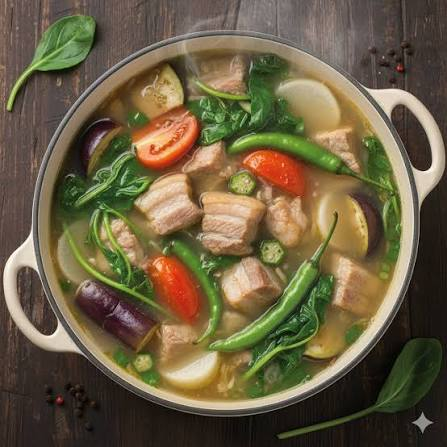
      

      

        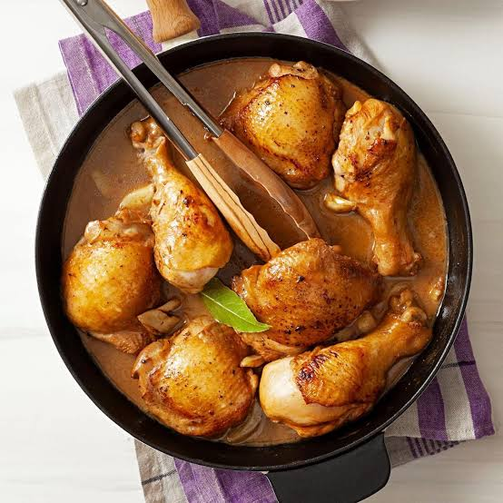
      

      

        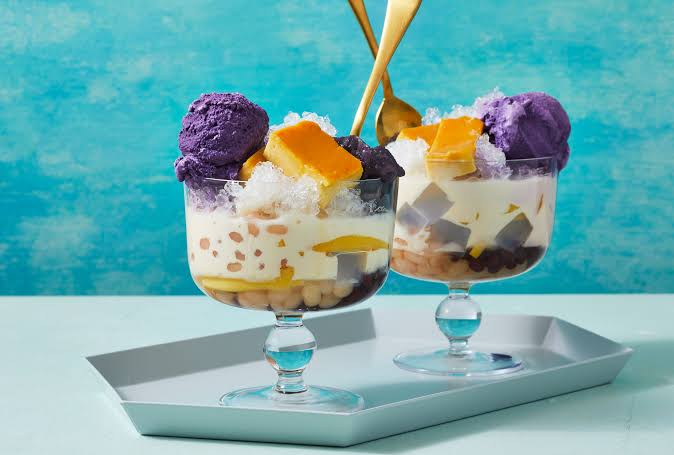
      

    

    <button class="carousel-control-prev" type="button" data-bs-target="#heroCarousel" data-bs-slide="prev">
      
    </button>
    <button class="carousel-control-next" type="button" data-bs-target="#heroCarousel" data-bs-slide="next">
      
    </button>
  

  

    Table for one · Est. 2026
    <h1>Sarap ng Bahay, Serve sa Bawat Plato</h1>
    
A photo showcase of the dishes we grew up on — from sizzling sisig to sweet halo-halo — plated with a little extra flair.

    <a href="#gallery" class="btn btn-lg rounded-pill btn-reserve px-4">View the Gallery</a>
  

</header>

<section id="featured">
  

    Chef's Picks
    <h2 class="mb-4">Tonight's Featured Plates</h2>
    

      

        

          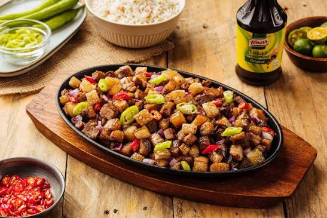
          

            <h5 class="mb-0">Crispy Pork Sisig</h5>
            <small>Sizzling plate, calamansi &amp; egg</small>
          

        

      

      

        

          
          

            <h5 class="mb-0">Kare-Kare</h5>
            <small>Oxtail stew, peanut sauce</small>
          

        

      

      

        

          
          

            <h5 class="mb-0">Halo-Halo</h5>
            <small>Shaved ice, ube, leche flan</small>
          

        

      

    

  

</section>

<section class="bg-charcoal py-5">
  

    

      

        
12+

        
Signature Dishes

      

      

        
4

        
Menu Categories

      

      

        
8

        
Years Serving

      

      

        
100%

        
Homestyle Recipes

      

    

  

</section>

<section id="gallery">
  

    The Full Menu
    <h2 class="mb-2">Gallery of Dishes</h2>
    
Tap any photo for the full plate description. Filter by category below.

    <ul class="nav cat-pills mb-4" id="categories">
      <li class="nav-item"><button class="nav-link active" data-filter="all">All</button></li>
      <li class="nav-item"><button class="nav-link" data-filter="appetizers">Appetizers</button></li>
      <li class="nav-item"><button class="nav-link" data-filter="mains">Mains</button></li>
      <li class="nav-item"><button class="nav-link" data-filter="desserts">Desserts</button></li>
      <li class="nav-item"><button class="nav-link" data-filter="drinks">Drinks</button></li>
    </ul>

    

            

        

          

            
          

          

            Appetizers
            <h5 class="card-title mb-1">Lumpiang Shanghai</h5>
            
Crispy pork &amp; veggie spring rolls

            ₱150
          

        

      

            

        

          

            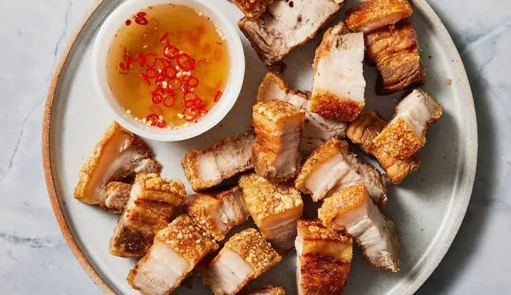
          

          

            Appetizers
            <h5 class="card-title mb-1">Lechon Kawali</h5>
            
Crispy fried pork belly

            ₱280
          

        

      

            

        

          

            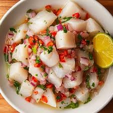
          

          

            Appetizers
            <h5 class="card-title mb-1">Kinilaw na Tanigue</h5>
            
Filipino-style ceviche

            ₱260
          

        

      

            

        

          

            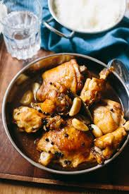
          

          

            Mains
            <h5 class="card-title mb-1">Chicken Adobo</h5>
            
Soy-vinegar braised chicken

            ₱220
          

        

      

            

        

          

            
          

          

            Mains
            <h5 class="card-title mb-1">Sinigang na Baboy</h5>
            
Sour pork &amp; vegetable stew

            ₱260
          

        

      

            

        

          

            
          

          

            Mains
            <h5 class="card-title mb-1">Kare-Kare</h5>
            
Oxtail peanut stew

            ₱320
          

        

      

            

        

          

            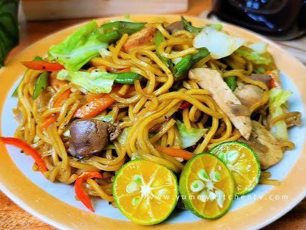
          

          

            Mains
            <h5 class="card-title mb-1">Pancit Canton</h5>
            
Stir-fried noodles

            ₱190
          

        

      

            

        

          

            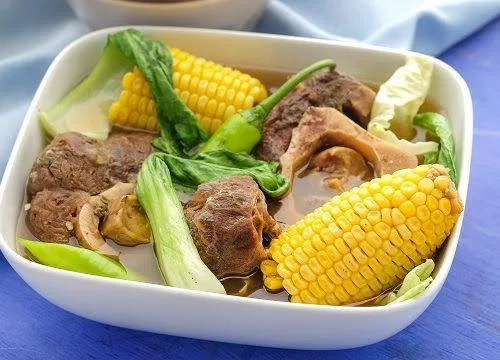
          

          

            Mains
            <h5 class="card-title mb-1">Bulalo</h5>
            
Beef shank marrow soup

            ₱340
          

        

      

            

        

          

            
          

          

            Desserts
            <h5 class="card-title mb-1">Halo-Halo</h5>
            
Mixed shaved-ice dessert

            ₱165
          

        

      

            

        

          

            
          

          

            Desserts
            <h5 class="card-title mb-1">Leche Flan</h5>
            
Caramel egg custard

            ₱95
          

        

      

            

        

          

            
          

          

            Desserts
            <h5 class="card-title mb-1">Turon</h5>
            
Caramelized banana roll

            ₱80
          

        

      

            

        

          

            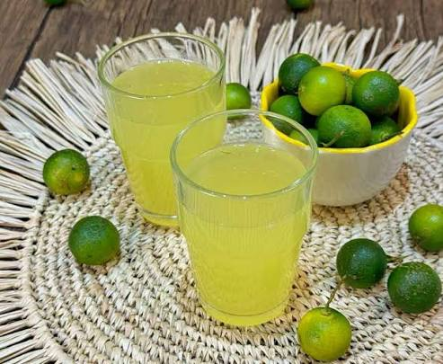
          

          

            Drinks
            <h5 class="card-title mb-1">Calamansi Juice</h5>
            
Fresh Philippine lime cooler

            ₱70
          

        

      

    

  

</section>

<section id="about" class="bg-white">
  

    

      

        Our Story
        <h2 class="mb-3">From a Family Kitchen to Your Table</h2>
        
KAINAN started as a weekend karinderya run out of a home kitchen. Every recipe on this menu has been passed down, tweaked, and taste-tested by three generations — no shortcuts, just patience and a heavy hand with garlic.

        
Every dish here is plated the way we'd serve it at our own table: generous, a little rustic, and meant to be shared.

        

          Homestyle
          Locally Sourced
          Family Recipes
        

      

      

        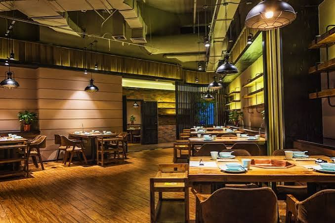
      

    

  

</section>

<section id="contact" class="bg-charcoal">
  

    

      

        Get in Touch
        <h2 class="mb-3">Visit or Message Us</h2>
        
Katapatan Mutual Homes, Brgy. Banay-banay, City of Cabuyao, Laguna &nbsp;·&nbsp; Open daily, 10AM–9PM

        <form class="text-start" onsubmit="return false;">
          

            <input type="text" class="form-control" id="cName" placeholder="Your name">
            <label for="cName">Your name</label>
          

          

            <input type="email" class="form-control" id="cEmail" placeholder="you@email.com">
            <label for="cEmail">Email address</label>
          

          

            <textarea class="form-control" id="cMsg" style="height:100px" placeholder="Message"></textarea>
            <label for="cMsg">Message</label>
          

          <button type="submit" class="btn btn-reserve w-100 rounded-pill py-2">Send Message</button>
        </form>
      

    

  

</section>

<footer class="bg-charcoal border-top border-secondary-subtle py-4">
  

    &copy; 2026 KAINAN Restaurant &amp; Showcase. All rights reserved.
    

      <a href="#" class="social-icon" data-bs-toggle="tooltip" title="Facebook"><i class="bi bi-facebook"></i></a>
      <a href="#" class="social-icon" data-bs-toggle="tooltip" title="Instagram"><i class="bi bi-instagram"></i></a>
      <a href="#" class="social-icon" data-bs-toggle="tooltip" title="TikTok"><i class="bi bi-tiktok"></i></a>
      <a href="#" class="social-icon" data-bs-toggle="tooltip" title="Call us"><i class="bi bi-telephone-fill"></i></a>
    

  

</footer>

  

    

      

        <h5 class="modal-title" id="modalDishTitle">Dish name</h5>
        <button type="button" class="btn-close" data-bs-dismiss="modal" aria-label="Close"></button>
      

      
      

        

        
      

    

  

  

    <h5 class="offcanvas-title">Reserve a Table</h5>
    <button type="button" class="btn-close" data-bs-dismiss="offcanvas"></button>
  

  

    <form onsubmit="return false;">
      

        <label class="form-label">Full name</label>
        <input type="text" class="form-control">
      

      

        <label class="form-label">Party size</label>
        <select class="form-select">
          <option>1–2 guests</option>
          <option>3–4 guests</option>
          <option>5+ guests</option>
        </select>
      

      

        <label class="form-label">Date &amp; time</label>
        <input type="datetime-local" class="form-control">
      

      <button class="btn btn-reserve w-100 rounded-pill">Confirm Reservation</button>
    </form>
  

</body>
</html>
